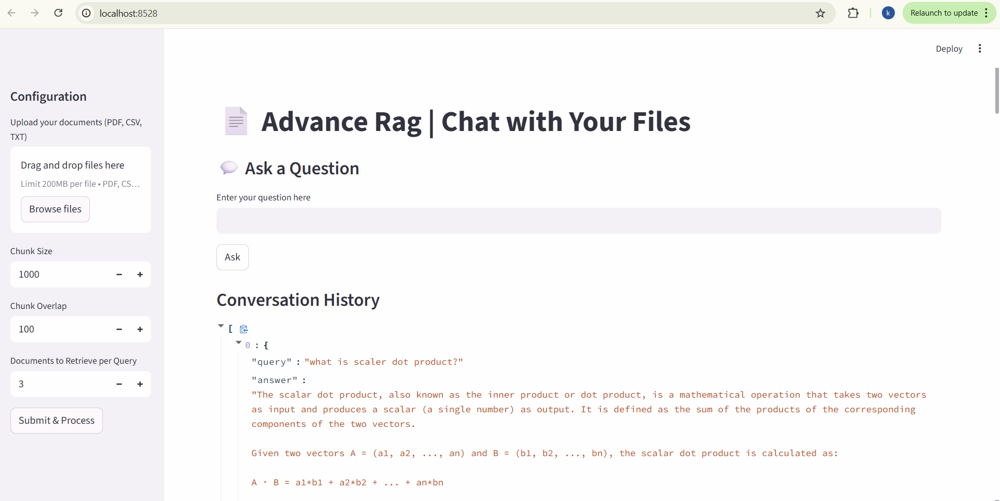
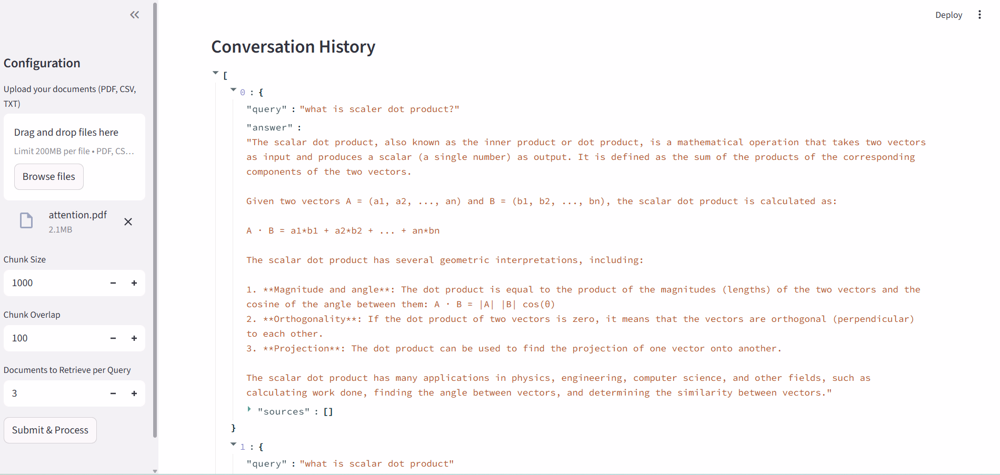

# Advanced RAG Document Q&A System

An Advanced Retrieval-Augmented Generation (RAG) system that enables intelligent, context-aware question answering over PDF documents with conversational memory and ultra-low latency inference using Groq.

---

## Key Features

* Chat with PDFs – Upload documents and ask questions in natural language
* Conversational Memory – Supports multi-turn conversations with context retention
* Ultra-Low Latency – Powered by Groq LPU for near-instant responses
* High Accuracy Retrieval – Optimized chunking and FAISS vector search
* Context-Aware Responses – Reduces hallucinations using grounded answers
* Interactive UI – Built with Streamlit for real-time interaction

---

## Architecture Overview

```
User Query → Memory Augmentation → Embedding → FAISS Retrieval → Context Injection → Groq LLM → Response
```

---

## Tech Stack

| Technology | Role                  |
| ---------- | --------------------- |
| Python     | Core Language         |
| LangChain  | RAG Pipeline & Memory |
| FAISS      | Vector Database       |
| Groq API   | Fast LLM Inference    |
| Streamlit  | Web Interface         |
| PyPDF      | Document Processing   |

---

## Screenshots

### Home Interface



### Chat Interaction


### Conversation Memory



### Sidebar Settings


---

## Project Structure

```
advanced-rag-doc-qa/
│── app.py
│── requirements.txt
│── .gitignore
│── README.md
│── screenshots/
│   ├── home_ui.png
│   ├── chat_interaction.png
│   ├── conversation_memory.png
│   ├── sidebar_settings.png
```

---

## Installation and Setup

### Clone the Repository

```
git clone https://github.com/khushi-1102/advanced-rag-doc-qa.git
cd advanced-rag-doc-qa
```

### Create Virtual Environment

```
python -m venv venv
source venv/bin/activate   # Mac/Linux
venv\Scripts\activate      # Windows
```

### Install Dependencies

```
pip install -r requirements.txt
```

### Run the Application

```
streamlit run app.py
```

---

## How It Works

1. User uploads a PDF document
2. Text is split into optimized chunks
3. Chunks are converted into embeddings
4. Stored in FAISS vector database
5. User asks a question
6. Memory enhances query context
7. Relevant chunks retrieved
8. Groq LLM generates fast response

---

## Performance Highlights

* Approximately 27x faster response compared to traditional GPU-based inference
* Improved retrieval accuracy using optimized chunking strategy
* Seamless multi-turn conversations with conversational memory

---

## Limitations

* Currently supports text-only documents (no image understanding)
* Depends on external API (Groq)

---

## Future Improvements

* Multimodal RAG (Image + Text)
* Voice-based interaction
* Re-ranking for better retrieval
* Scalable deployment with vector databases (Pinecone / Weaviate)

---

## Use Cases

* Study assistant for PDFs
* Enterprise document search
* Research paper analysis
* Customer support automation

---

## Author

Khushi
B.Tech CSE (AI/ML)
Interested in AI, ML, and real-world intelligent systems

---

## Contribution

Contributions are welcome. Feel free to fork the repository and submit a pull request.